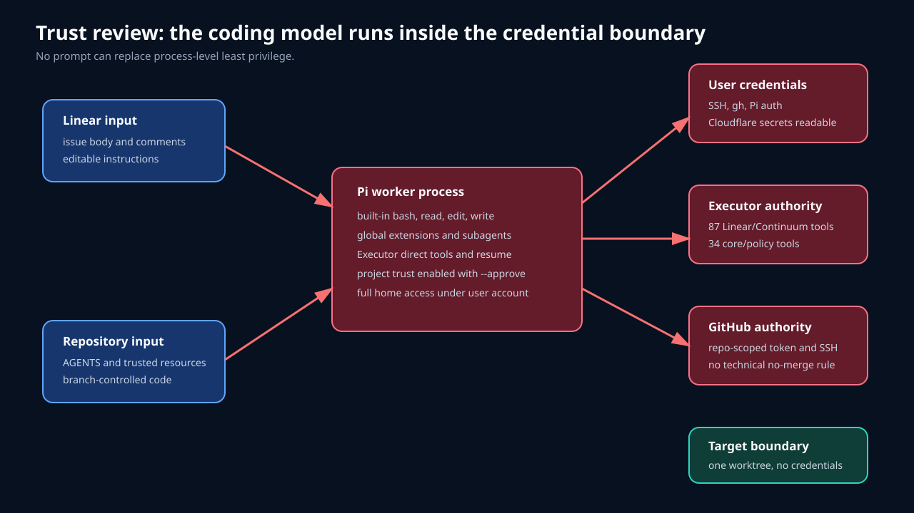

# Pipeline architecture and control flow


## Intended authority split

The conceptual split is sound:

| System | Intended authority |
| --- | --- |
| Linear | assignment, priority, dependencies, coordination status |
| Continuum | execution plan, discoveries, decisions, outcome |
| GitHub | source branch, CI, review, merge |

The implementation does not preserve that split at process boundaries. One Pi session holds tools or shell credentials for all three systems and decides every transition.

## Deployed components

| Component | Input | Output and side effects |
| --- | --- | --- |
| `linear-agent-worker@.timer` | elapsed five-minute interval | starts one service after prior service becomes inactive |
| `linear-agent-worker@.service` | profile name | launches `run-once`; 100-minute outer timeout |
| `run-once` | mode-0600 shell config | validates paths, locks profile, renders prompt, runs Pi for up to 90 minutes |
| Pi worker | protocol prompt, runtime envelope, project context, Linear content | selects issue, changes Linear, creates Continuum task, edits source, invokes subagents, commits, pushes, opens PR |
| Executor MCP | global Executor connection | exposes 20 Continuum, 53 Linear, and 34 Executor core tools |
| control checkout | pipeline branch and stable path | project context, durable ledger identity, nested worktree parent |
| issue worktree | requested base branch | source edits, tests, commit, pushed branch |
| validation helper | issue worktree | temporary HOME, XDG, workspace, full validation result |
| run/session storage | Pi and wrapper events | mode-0600 prompt, text log, and JSONL sessions |

The deployed source is `ops/linear-agent-worker` at `c9798b5`. Polling was disabled for this review after CHI-99 completed.

## Shell preflight

`run-once` has useful deterministic checks before Pi starts:

1. Validate profile syntax.
2. Require a config file with no group or other access.
3. Require all profile fields.
4. Resolve the control repository and prompt.
5. Refuse a dirty control checkout.
6. Require an `origin` remote.
7. Require Pi, MCP config, `flock`, and `timeout`.
8. Create private state, session, and worktree directories.
9. Ignore nested worktrees in the control checkout.
10. Acquire a profile lock.
11. Render a run ID and lease expiration.
12. Exit on dry run or invoke Pi.

These checks do not query Linear. Pi starts even when no eligible issue exists.

## Model-owned state machine

```text
start
  -> inspect control context and Continuum
  -> query Linear
     -> no eligible issue: NO_WORK
     -> expired own issue: recovery candidate
     -> highest-priority Todo: new candidate
  -> validate issue contract
     -> incomplete or unsafe: stop or block
  -> move to In Progress
  -> write lease comment
  -> re-read issue
     -> conflict: stop
  -> create or resume Continuum task
  -> create or resume issue worktree
  -> reproduce, edit, test
     -> external/human blocker: Backlog + needs-human
     -> validation failure: preserve worktree and block
  -> commit and push
  -> open PR
  -> complete Continuum task
  -> comment handoff
  -> move Linear to In Review
  -> stop
```

Every state decision after shell preflight is natural-language policy interpreted by the coding model. The wrapper neither parses the issue nor verifies the final state.

## Linear preparation and assignment

The pipeline uses stock team states:

```text
Backlog -> Todo -> In Progress -> In Review -> Done
Blocked -> Backlog + needs-human
```

`agent:effect` is the routing label. Human movement to Todo is the intended authorization event. This is easy to operate and does not require workspace-wide custom states.

Eligibility is expressed in prose. The model checks repository, base branch, intent, evidence, scope, exclusions, acceptance criteria, validation, safety, and blockers. There is no machine-readable issue schema or deterministic rejection reason.

## Claim and lease

A claim consists of:

1. Linear status update to In Progress.
2. Comment with run ID, host, expiration, and base.
3. Model re-read.

`flock` prevents two runs of one local profile. The systemd oneshot and `OnUnitInactiveSec` prevent timer overlap. They do not protect another host or profile.

The lease is comment text. No supervisor parses or renews it. CHI-98 recovery required an explicit human comment releasing an unexpired lease. CHI-99 sent a heartbeat after about 19 minutes and a later validation update, demonstrating that the prompt can produce useful progress messages.

## Worktree and validation path

Nested ignored worktrees are a good fit for one-host execution:

```text
continuum-control/
  .git/
  .linear-agent-worktrees/
    CHI-98/
    CHI-99/
```

The control checkout stayed clean through both implementations. Failed work was preserved. Recovery resumed the same CHI-98 branch successfully.

The first CHI-98 run exposed two Continuum generations in the control workspace. The later helper fixed test isolation:

```text
issue worktree source
  -> temporary HOME
  -> temporary XDG_DATA_HOME
  -> temporary git workspace
  -> worktree bin/continuum
  -> bun run validate
  -> remove temporary state
```

That helper protects validation. It does not resolve the durable control ledger split.

## Handoff path

Observed successful handoff:

- commit and branch pushed;
- PR opened against the requested feature branch;
- Linear handoff comment added;
- Continuum task completed;
- Linear moved to In Review;
- no merge performed;
- GitHub CI passed for PRs #7 and #8.

The worker moves to In Review before CI completes. No later process reconciles a failed check, closed PR, requested changes, or merged PR.

## Process boundaries



The only strong runtime boundary is the operating-system user. `ProtectSystem=strict`, `PrivateTmp`, `NoNewPrivileges`, kernel protections, and address-family limits protect parts of the OS. `ProtectHome` is absent. Pi runs as the user's account with full home access.

`--approve` means Pi trusts project-local resources. It is not a tool-operation approval flag. Pi documentation states that extensions and packages execute with full system access.

Executor uses direct tools and no include/exclude list. Executor itself pauses some writes, but `resume` is exposed to the same model. Recorded sessions contain 16 model-issued resume calls.

## Current versus target


The target separates cognition from authority:

- a deterministic supervisor reads and claims Linear work;
- the coding model receives one frozen issue envelope;
- the model can write only one sandboxed worktree;
- the model has no Linear, GitHub, SSH, cloud, or Executor policy credentials;
- a verifier checks structured output, validation, Git state, and PR state;
- the supervisor writes Continuum and Linear transitions.

The timer may remain as a wakeup mechanism. It should not start Pi until deterministic dispatch has claimed work.
