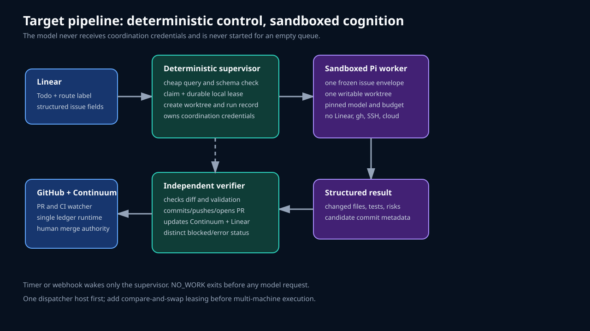

# Pipeline repair plan

The useful parts can be retained. The pipeline does not need a workflow engine.

## Keep

- Linear Backlog, Todo, In Progress, In Review, and Done states;
- human promotion to Todo;
- routing and risk labels;
- one issue per run;
- systemd as the wakeup and process supervisor;
- profile `flock` and non-overlapping oneshot timer;
- dedicated clean control checkout;
- isolated Git worktrees;
- preservation on failure;
- 90-minute wall-clock limit;
- Continuum task cross-links;
- isolated Continuum validation helper;
- PR-only handoff with human merge authority;
- mode-0600 run artifacts.

## Change

- move issue discovery and claims out of Pi;
- move Linear, Continuum, GitHub, SSH, and Executor credentials out of Pi;
- replace text outcomes with a schema;
- verify outcomes independently;
- pin model, tools, packages, and deployed versions;
- add cost limits and disable ambient subagents;
- make the control ledger one runtime;
- add CI reconciliation and alerts.

## Remove

- five-minute model polling;
- all-Executor direct tool exposure in the coding session;
- the model's `resume` and policy-management capability;
- arbitrary validation commands sourced from issue prose;
- ambient global extension/package loading;
- full user-home access;
- interpretation of a successful Pi exit as successful handoff.

## Phase 0: keep the timer paused

Completed for this review. Do not resume the current unattended timer. Manual issue runs are also subject to the authority findings and should wait for the minimum control split below.

## Phase 1: deterministic dispatch

Add a small `dispatch-once` program that does not call a model.

Inputs:

- project ID;
- assignee ID;
- routing label ID;
- ready and active state IDs;
- allowed repository and base branches;
- local run-state directory.

Behavior:

1. Query exact Linear issue fields.
2. Recover a local run only when its recorded process is dead or complete.
3. Sort eligible Todo issues by priority and creation time.
4. Parse a versioned assignment contract.
5. Check dependency state and allowlists.
6. Claim one issue and re-read it.
7. Write a frozen assignment JSON file.
8. Start the coding worker.
9. Exit before Pi when no issue exists.

A first contract can be small:

```json
{
  "version": 1,
  "linearId": "CHI-104",
  "repository": "chrhicks/continuum",
  "baseBranch": "master",
  "intent": "...",
  "scope": ["..."],
  "excluded": ["..."],
  "acceptance": ["..."],
  "risk": ["data-safety"],
  "validationProfile": "continuum"
}
```

Do not accept executable validation commands from the issue. `validationProfile` selects reviewed local configuration.

## Phase 2: split supervisor and coder authority



### Supervisor

May access:

- narrowed Linear read/update/comment operations;
- one Continuum runtime;
- Git and GitHub for the configured repository;
- systemd run state.

Owns:

- claims and leases;
- worktree creation;
- Continuum task updates;
- final commit and push;
- PR creation;
- Linear transitions;
- CI reconciliation.

### Coding worker

May access:

- frozen assignment JSON;
- one writable issue worktree;
- temporary HOME and XDG state;
- repository validation tools;
- model provider through a dedicated low-value account or broker.

Must not access:

- Linear or Executor;
- Continuum control ledger;
- `gh` config or SSH keys;
- Cloudflare and other user secrets;
- unrelated home directories;
- other worktrees;
- merge or deployment tools.

A dedicated Unix account or container is preferable. For an initial personal deployment, a dedicated account with only model credentials and one repository worktree is materially safer than another systemd unit under the main user.

## Phase 3: structured worker result

Run Pi in JSON or RPC mode. Require the final result to decode as:

```json
{
  "version": 1,
  "outcome": "candidate" | "blocked" | "failed",
  "changedFiles": ["src/example.ts"],
  "validation": [
    { "profile": "continuum", "status": "passed", "evidence": "..." }
  ],
  "discoveries": ["..."],
  "decisions": ["..."],
  "remainingRisks": ["..."]
}
```

The supervisor then verifies:

- changes are inside the worktree;
- no excluded path changed;
- branch descends from the requested base;
- validation profile passed independently;
- worktree contains no secrets or generated agent artifacts;
- commit and push succeed without force;
- PR base and head are exact;
- Linear and Continuum transitions succeeded.

Use distinct service results for no-work, blocked, handoff, timeout, infrastructure failure, and malformed result.

## Phase 4: budget and resource policy

Pin in profile configuration:

- Pi version;
- provider and model;
- thinking level;
- allowed built-in tools;
- explicit skill paths;
- no ambient project extensions;
- subagents disabled by default;
- maximum turns, child sessions, tokens, dollars, and elapsed time.

The supervisor should read Pi usage events and enforce the budget during the run. Include parent and child costs in handoff evidence.

Suggested initial limits:

```text
NO_WORK model cost: $0 because no model starts
routine issue budget: $3
approved complex issue budget: $8
subagents: 0 by default, maximum 2 when explicitly approved
wall time: 60 minutes routine, 90 minutes approved complex
```

Tune these from accepted work, not from model preference.

## Phase 5: one Continuum ledger

Before the next automated claim:

1. Identify the exact Continuum package and database used by Executor.
2. Identify the exact CLI and database used by shell operations.
3. Choose one pinned runtime.
4. Add a preflight that reports runtime version, workspace identity, and canonical database.
5. Stop before claim on mismatch.
6. Plan explicit reconciliation of the existing stores separately.

The validation helper should remain. Test state and durable execution state should never share a database.

## Phase 6: lifecycle and observability

Add:

- `linear-agent status` for timer, service, current issue, lease, budget, worktree, PR, and last result;
- `OnFailure` notification;
- blocked notification;
- CI watcher;
- log and session rotation;
- worktree retention until merge, then human-approved cleanup;
- deployment manifest with source and prompt hashes;
- fake Linear, GitHub, Continuum, and Pi integration tests.

Test cases must include:

- empty queue without Pi launch;
- incomplete issue contract;
- dependency blocked;
- simultaneous claim attempt;
- timeout and dead process;
- expired lease recovery;
- malformed model result;
- validation failure;
- push or PR failure;
- CI failure after PR;
- malicious issue instructions;
- forbidden changed path;
- budget exhaustion.

## Phase 7: scout mode

Keep scout disabled until:

- the repaired worker completes at least three accepted PRs;
- no run exceeds budget unexpectedly;
- block/recovery and CI failure tests pass;
- proposals cannot apply the routing label or move themselves to Todo through process permissions, not only prompt text.

The scout should have read-only repository access and narrowly scoped Linear issue-creation authority. It should not share the implementation worker's credentials or profile.
