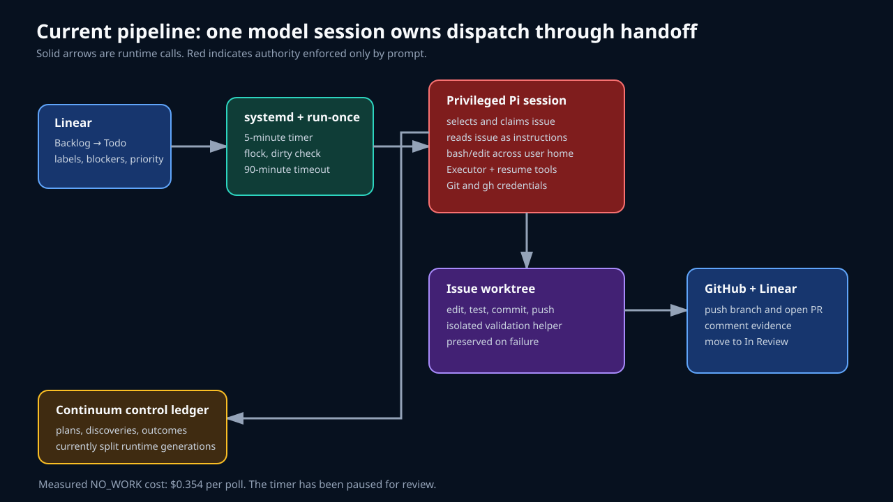
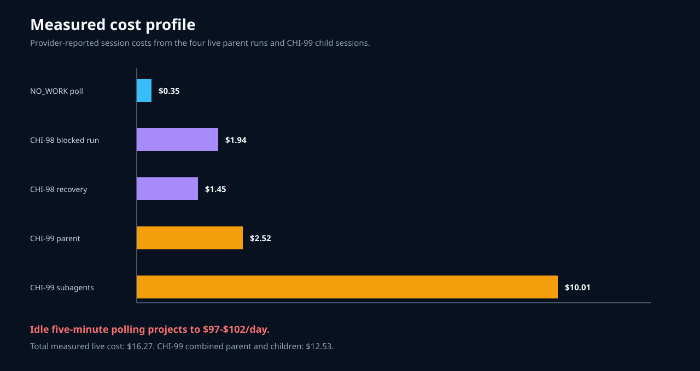

# Linear agent pipeline review

## Verdict

**Keep the timer paused. The workflow model is promising, but the deployed pipeline is not ready for broad unattended operation.**

The pilot proved valuable behavior:

- human-controlled Todo queue;
- one issue per run;
- local lock and non-overlap;
- clean control checkout;
- isolated worktrees;
- safe block and preserved state;
- successful recovery;
- Continuum handoff;
- PR creation without merge;
- green CI for PRs #7 and #8.

Two P0 problems outweigh those successes:

1. An empty five-minute poll launches the full model. The measured NO_WORK cost projects to about **$97-$102 per idle day**.
2. The coding model runs with the user's home, GitHub/SSH credentials, broad Executor tools, and self-resumable writes. Prompt rules are the only no-merge, no-secret, and no-policy boundary.

## Findings

| ID | Priority | Finding |
| --- | --- | --- |
| PIP-001 | P0 | Every empty poll launches the full coding model |
| PIP-002 | P0 | Prompt rules are the only barrier around broad host and repository authority |
| PIP-003 | P1 | Dispatch, eligibility, dependencies, and claims are model decisions |
| PIP-004 | P1 | Linear and repository text are untrusted instructions in a privileged session |
| PIP-005 | P1 | Wall-clock timeout does not bound model or subagent cost |
| PIP-006 | P1 | The control ledger is served by two Continuum runtime generations |
| PIP-007 | P1 | The supervisor does not verify outcomes or distinguish result classes |
| PIP-008 | P2 | Leases are comments interpreted by the model |
| PIP-009 | P2 | CI and deployed component drift are not reconciled |
| PIP-010 | P2 | Operational tests, retention, cleanup, and alerts are incomplete |

See [the full findings](02-findings.md) and [machine-readable JSON](data/findings.json).

## Measured operation

| Run | Outcome | Cost |
| --- | --- | ---: |
| empty queue | NO_WORK | $0.35 |
| CHI-98 first attempt | safe block | $1.94 |
| CHI-98 recovery | PR #7 | $1.45 |
| CHI-99 parent | PR #8 | $2.52 |
| CHI-99 subagents | reviews and implementation help | $10.01 |
| total | four parent and four child sessions | **$16.27** |

CHI-99 cost $12.53 including children. The pipeline did not pin model or thinking and set no child-count, token, or dollar limit.

## Recommended shape

Use a deterministic supervisor for Linear, Continuum, Git, credentials, leases, and verification. Start Pi only after one issue is claimed. Run Pi in a sandbox with one worktree, a frozen issue envelope, pinned budget, and no coordination credentials.

The detailed sequence is in [the repair plan](03-repair-plan.md).

## Reports

- [Architecture and control flow](01-architecture.md)
- [Prioritized findings](02-findings.md)
- [Repair plan](03-repair-plan.md)
- [Method and evidence](04-method.md)
- [Run metrics](data/runs.json)
- [Deployment metrics](data/metrics.json)
- [Findings JSON](data/findings.json)

## Current operational state

At review snapshot:

- timer: **disabled**;
- worker service: inactive;
- CHI-98: In Review, PR #7, green CI;
- CHI-99: In Review, PR #8, green CI;
- CHI-100 through CHI-103: Backlog;
- scout mode: disabled;
- no worker-created PR was merged.

This report intentionally stops before mapping pipeline findings to the earlier XDG branch review.
