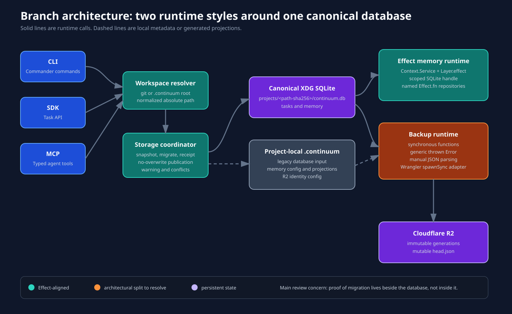
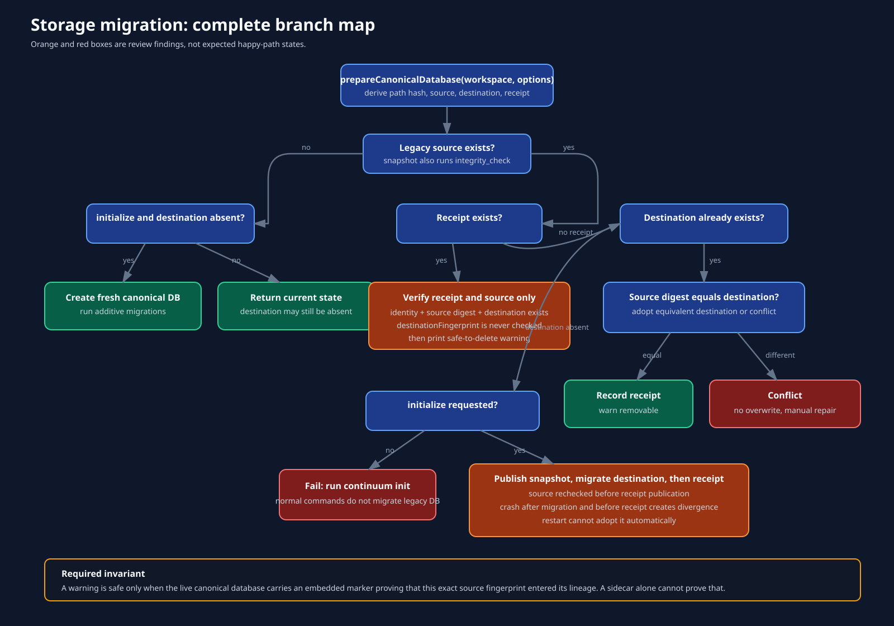
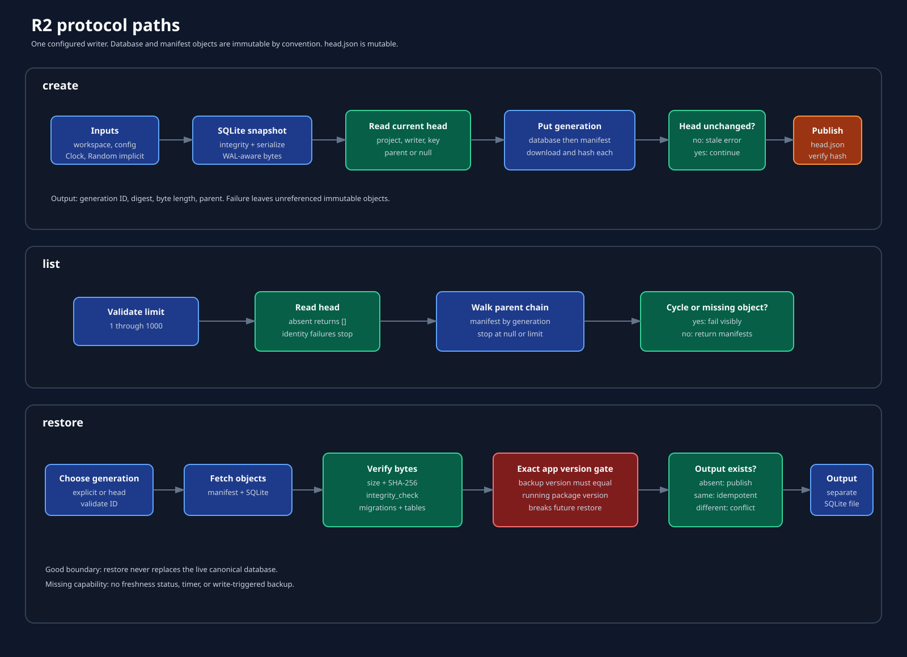

# Architecture review



## Scope

The review compares `master` at `e693a59` with branch head `30090c3`. The branch changes three architectural areas:

1. Canonical project storage moves from `.continuum/continuum.db` to one XDG database per workspace.
2. R2 adds versioned snapshots and separate-file restore.
3. Memory code moves from Effect v3 to the pinned `effect@4.0.0-beta.107` API.

The task and memory schema remain in one SQLite database. That was the right call. Splitting task and memory persistence would add cross-database consistency problems without solving a user problem.

## Component map

| Component | Owns | Inputs | Outputs and effects | Review disposition |
| --- | --- | --- | --- | --- |
| `workspace/resolve.ts` | Workspace root discovery | invocation path, `--cwd`, git and `.continuum` markers | normalized workspace context | Keep, but stop using the absolute path as durable identity |
| `db/paths.ts` | XDG and local path construction | workspace path, HOME, XDG_DATA_HOME | path hash and canonical paths | Replace path hash with stable workspace UUID |
| `db/storage.ts` | One-time canonical database preparation | workspace root, initialize and warn flags | DB creation or migration, receipt, warning, conflict | Keep the coordinator role; redesign proof and restart state |
| `db/storage-snapshot.ts` | SQLite snapshot and no-overwrite publication | database path or bytes | integrity-checked bytes, staged file, hard link | Keep; add parent-directory durability and typed errors |
| `db/storage-receipt.ts` | Sidecar migration receipt | source and destination fingerprints | JSON receipt and warning | Demote sidecar to audit output; put lineage proof inside SQLite |
| `memory/runtime/memory-runtime.ts` | Scoped memory DB authority | workspace, memory directory, DB path | `MemoryRuntime` service and closed handle | Keep |
| memory application modules | Memory policy and sequencing | parsed options, repositories, runtime config | typed Effects and projections | Keep, narrow remaining `unknown` errors |
| repository factories | Operations over an acquired DB handle | `DbHandle` | named Effect functions | Keep as explicit values, not Context services |
| `backup/service.ts` | Snapshot, lineage, and restore policy | workspace, object store, date | R2 generations or recovery file | Keep the three-operation surface; migrate implementation to Effect |
| `backup/object-store.ts` | Wrangler process boundary | bucket, key, bytes, child environment | downloaded bytes or upload | Make this the concrete adapter for an application-owned object-store service |
| `backup/contracts.ts` | Remote/config wire contracts | bytes and primitive fields | parsed config, head, and manifest | Replace manual parsers with Effect Schema |
| `cli/commands/backup.ts` | Human CLI adapter | Commander options | calls backup operations and renders output | Keep thin; render typed errors rather than `UNKNOWN_ERROR` |
| R2 | Remote recovery storage | immutable DB and manifest objects, mutable head | durable object versions | Keep one-writer limitation explicit |

## Dependency direction

The intended dependency direction is mostly clean:

```text
CLI / SDK / MCP
       |
       v
workspace context --> storage coordinator --> SQLite and filesystem
       |
       +--> memory application --> repository values --> MemoryRuntime handle
       |
       +--> backup application --> object-store port --> Wrangler --> R2
```

The branch implements the first memory path with Effect. The backup path skips the application-owned port and calls a concrete synchronous adapter through a plain TypeScript interface. The interface is useful, but errors, lifecycle, time, randomness, configuration, and process execution do not propagate as Effect requirements.

## Storage identity

The branch keys local storage with:

```text
sha256(realpath(workspaceRoot))
```

This keeps unsafe path text out of filenames and prevents collisions in ordinary use. It is not a project identity. A rename changes the hash. A moved repository still carries `.continuum`, so workspace discovery succeeds, but the canonical lookup points at a new path and silently creates an empty database.

A stable local identity can stay simple:

```text
.continuum/workspace.json
  formatVersion
  workspaceId (UUID)

$XDG_DATA_HOME/continuum/projects/<workspaceId>/continuum.db
```

The metadata file moves with the workspace. A user-level registry may map known paths to the UUID for diagnostics, but the path is not the authority. A clean clone can create a new UUID or explicitly link to an R2 project identity.

## Migration proof

The branch records source and destination fingerprints in a sidecar receipt. Later verification checks:

- receipt version;
- path-derived project identity;
- workspace and source/destination paths;
- current source digest; and
- destination existence.

It does not prove that the live destination descends from the migrated source. `destinationFingerprint` is written but never used. Exact destination hashing would also be wrong after legitimate writes.

The proof belongs in the database lineage. A small table can carry it:

```text
canonical_storage_lineage
  migration_id
  source_fingerprint
  source_path_at_migration
  migrated_at
  method
```

The row should be inserted into the staged destination before publication. Later writes do not invalidate it. Replacing the canonical database removes the marker, so the legacy removal warning fails closed.

## Crash model



The happy path is careful, but the commit point is split:

1. Publish a source snapshot as the canonical destination.
2. Run migrations in place.
3. Recheck the source.
4. Publish the receipt.

A crash between steps 2 and 4 leaves a valid migrated destination and an old source with no receipt. On restart, the destination and source hashes differ, so Continuum raises a permanent divergence conflict. The report reproduces this exact state with a migration-0000 source.

A restart-safe sequence is:

1. Snapshot the source.
2. Build a staged destination.
3. Run migrations on the staged destination.
4. Insert the lineage marker in the same staged database.
5. Run integrity checks.
6. fsync the staged file and parent directory.
7. Publish without overwrite.
8. Write the sidecar receipt as audit output.

Restart can adopt a destination when its embedded marker matches the current source fingerprint.

## R2 model



The protocol makes several good choices:

- SQLite is serialized instead of uploading WAL and SHM files.
- Database and manifest objects use random immutable generation keys.
- Uploaded objects are downloaded and hashed before head publication.
- A second head read detects a stale writer before publication.
- Restore always targets a separate file and refuses divergence.
- Missing, cyclic, corrupt, cross-project, and cross-writer lineage fails visibly.

The protocol is not multi-writer safe. Wrangler exposes no compare-and-swap write for `head.json`, and the check-then-put immutable operation is not atomic. The docs say this plainly. Keep that constraint.

The exact application-version gate is not useful. `applicationVersion` comes from the running package, not from SQLite. On restore, the code compares the historical manifest version to the new running package version and rejects any mismatch. Schema and migration compatibility should decide restore safety. The package version should remain informational.

## Composition roots

There are three preparation paths:

- Task SDK calls `getDbClient`, which prepares storage and opens the DB.
- MCP resolves storage explicitly, then builds repository values around a cached handle.
- Memory CLI resolves storage, then provides a scoped `MemoryRuntime` layer.

The different entrypoints preserve current contracts, but they make storage readiness and DB ownership harder to reason about. A later cleanup can centralize workspace and storage preparation at each true entrypoint, then pass a resolved canonical context inward. Do not add a global singleton to achieve this.

## Explicit keep decisions

- Keep one database per project rather than one global multi-project schema.
- Keep task and memory records in the same transactional database.
- Keep SQLite serialization and integrity validation.
- Keep no-overwrite restore to a separate recovery file.
- Keep the one-writer R2 contract until a real event-level merge protocol exists.
- Keep `MemoryRuntime` as the only current Context service.
- Keep repository factories as explicit values over `DbHandle`. The anti-slop service-constructor warnings for these factories are heuristic false positives.
- Keep the exact Effect beta pin while the project intentionally tracks beta. The npm beta tag still resolves to `4.0.0-beta.107` at review time.
