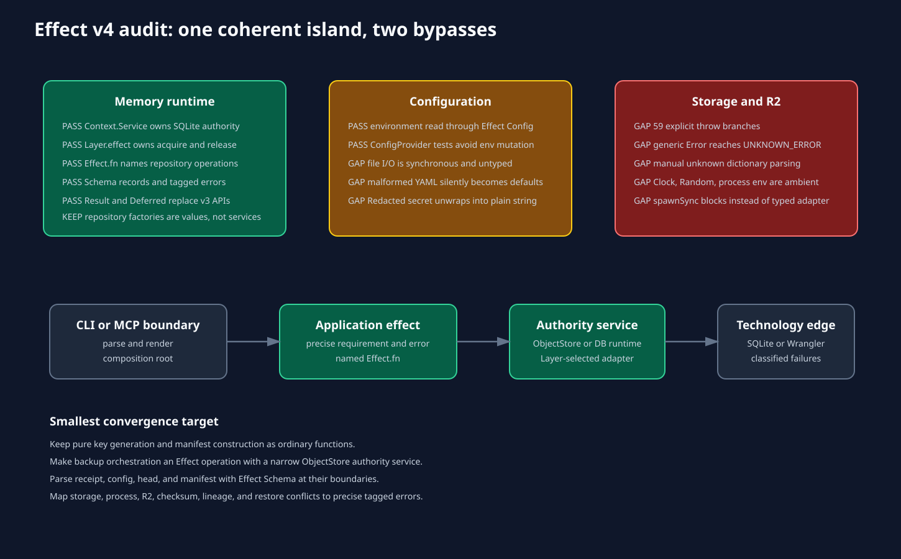

# Effect, code quality, and anti-slop review



## Governing guidance

The review used:

- the installed Effect skill at `~/.pi/agent/skills/effect/` on `chicks-arch`;
- its schema, services/layers, configuration, and testing references;
- the pinned `effect@4.0.0-beta.107` package source;
- Dillon Mulroy's `coding-standards` and `effect-service-design` skills;
- Dillon Mulroy's `anti-slop` Oxlint plugin at version 1.79.0;
- poteto's `unslop` prose skill.

The package source wins when a skill names an API that the pinned beta does not export. The branch correctly uses `Schema.TaggedError`, which is the beta.107 API, instead of blindly copying `Schema.TaggedErrorClass` from the skill text.

## Effect adherence matrix

| Guidance | Status | Evidence | Disposition |
| --- | --- | --- | --- |
| Compose workflows with `Effect.gen` | Pass | memory application and repositories | Keep |
| Name public or non-trivial operations with `Effect.fn` | Pass in memory | repository methods and config loader | Keep |
| Use `Context.Service` for real authority | Pass | `MemoryRuntime` owns acquired SQLite handle | Keep |
| Acquire and release resources through a Layer | Pass | `memoryRuntimeLayer` and `Effect.acquireRelease` | Keep; add a close test |
| Model records with Schema plus interface | Pass in memory | journal and recall domain modules | Keep |
| Model expected errors with schema-backed tags | Pass in memory, fail in new storage and backup | memory errors versus generic `Error` | Converge storage and backup |
| Decode unknown boundaries with Schema | Mixed | memory rows use Schema; backup and receipt parse manually | Replace manual backup and receipt parsing |
| Read runtime environment through Config | Mostly pass | summary environment uses `Config` | Keep, but preserve Redacted values |
| Keep secrets Redacted until adapter boundary | Fail | `Redacted.value` in `memory/config.ts` | Move unwrap to LLM adapter |
| Use precise error unions | Mixed | repositories are precise; consolidate and recall still expose `unknown`; backup throws | Narrow changed operations |
| Use deterministic test synchronization | Pass | consolidation race uses `Deferred` | Keep |
| Prefer Effect-aware tests and explicit layers | Partial | ConfigProvider and Result are used; tests still bridge `Effect.runPromise` from `bun:test` | Accept Bun adaptation; avoid adding a test framework only for style |
| Use built-in Clock and Random where authority matters | Fail in backup | `new Date()` and `randomUUID()` are ambient defaults | Yield Clock and Random in backup operation |
| Wrap external CLI at an adapter boundary | Structural pass, typed failure fail | `WranglerR2ObjectStore` exists but is synchronous and throw-based | Make it the concrete Layer for an object-store service |

## Service inventory and dispositions

The branch has one real application Context service.

| Candidate | Authority | Current shape | Verdict |
| --- | --- | --- | --- |
| `MemoryRuntime` | SQLite handle lifecycle and canonical memory context | tag, interface, layer, acquire/release | Keep |
| `JournalRepositoryService` | operations over an already acquired handle | explicit value factory | Keep as value |
| `ConsolidationRepositoryService` | operations over an already acquired handle | explicit value factory | Keep as value |
| `RecallRepositoryService` | operations over an already acquired handle | explicit value factory | Keep as value |
| `loadMemoryConfig` | environment and project config read | named Effect using built-in Config | Keep as Effect operation; type file failures |
| `BackupObjectStore` | remote object I/O and credentials | plain synchronous interface | Create an Effect authority service and Wrangler adapter Layer |
| canonical storage preparation | filesystem and SQLite migration authority | synchronous coordinator | Return an Effect with typed storage errors; a Context service is optional unless another implementation appears |
| Clock and Random | generation time and ID authority | ambient arguments/defaults | Use built-in Effect services inside backup orchestration |

Dillon's Effect anti-slop rule reports imports of `makeJournalRepository`, `makeConsolidationRepository`, and `makeRecallRepository`. Those are not service constructors anymore. They build explicit operation values over a handle owned by `MemoryRuntime` or MCP composition. Turning each repository back into a Context service would add shallow services and undo a good cleanup. These diagnostics are false positives under the deletion test.

`BackupObjectStore` is different. It owns network/process authority, credentials, and a real production/test variation. It passes the service test.

## Error architecture

Memory errors are schema-backed and retain tags such as `DatabaseOpenError`, `DecodeError`, and `ConsolidationConflictError`. The shared CLI renderer can classify them.

Storage has one custom `CanonicalStorageError`, which is useful but not Effect-native. Backup has no error algebra. The changed backup and storage inventory contains 59 explicit throw statements. Expected failures include:

- missing or incompatible config;
- process execution failure;
- remote missing object;
- remote upload/download failure;
- project and writer mismatch;
- stale head;
- immutable collision;
- checksum and SQLite integrity failure;
- lineage cycle;
- restore destination conflict.

These are expected outcomes, not defects. They should appear in operation error types and render as stable CLI codes. Today they collapse to `UNKNOWN_ERROR`.

A practical error family is enough. Avoid one class per line of code:

```text
BackupConfigurationError
BackupRemoteError { operation, key, cause }
BackupIdentityConflict
BackupLineageError
BackupIntegrityError
BackupRestoreConflict
```

## Boundary parsing

`src/backup/contracts.ts` is 266 lines of hand-written JSON and field checks. It recreates the capability already used by the memory domain. It also drives most net new anti-slop findings.

Effect Schema can define config, head, manifest, UUID, generation, digest, and metadata once. Decode functions then become named boundary effects with a `BackupDecodeError`. Pure object-key construction can remain ordinary TypeScript.

`readMigrationReceipt` has the opposite problem. It asserts parsed JSON to `MigrationReceipt` without checking nested fields. Identity comparison makes many malformed values fail closed, but this is still an unchecked boundary and makes future receipt changes brittle.

## Config and secrets

Moving environment reads to Effect Config is a clear improvement. The tests now use `ConfigProvider` instead of mutating global environment state.

Two details remain:

1. `Redacted.value` is called while building `MemoryConfig`, so the API key spends the rest of its life as a plain string.
2. `readConfigFile` catches every read and YAML parse failure and returns `null`. A malformed file is indistinguishable from an absent file.

Keep the key as `Redacted.Redacted` and unwrap it only inside the LLM request adapter. Return a typed config-file error for unreadable or malformed files. Preserve default behavior only for absence.

## Anti-slop results

The plugin was run unchanged against all branch and master source files from isolated worktrees.

| Rule | Master | Branch | Delta |
| --- | ---: | ---: | ---: |
| all diagnostics | 298 | 322 | +24 |
| unsafe dictionary type | 34 | 49 | +15 |
| unknown parameters | 34 | 38 | +4 |
| runtime `typeof` parsing | 77 | 81 | +4 |
| service constructor imports | 9 | 10 | +1 |
| assertion safety comments | 96 | 96 | 0 |

The full plugin is stricter than this repository. It flags legitimate low-level predicates and existing SQLite casts. Raw totals are not a quality score. The differential is useful: the branch's increase comes mainly from manual parsing in `backup/contracts.ts`.

The changed-file output contains 110 diagnostics because it includes old findings in files touched by the branch. See [the TSV](data/anti-slop-changed-files.tsv) for exact locations.

## Dead surface and unused exports

Knip reports the same broad baseline of unused scripts and exports on both revisions. The branch introduces five unused backup exports:

- `backupConfigPath`;
- `BACKUP_FORMAT_VERSION`;
- `BACKUP_OBJECT_PREFIX`;
- `projectPrefix`;
- `generationPrefix`.

The last four are used only inside their defining module. Keep them private until a real caller needs them. `backupConfigPath` can also be private unless external tooling is an intentional API.

Knip labels the two new test files as unused because it does not understand the repository's Bun test discovery. Those are false positives.

## Duplication, cycles, and size

- Exact clones: 10 on master and branch.
- Duplicated lines: 73 on master and branch.
- Circular dependencies: one on both revisions, between `memory/application/query.ts` and `query-recall.ts`.
- Source files above 300 lines: none.
- GOAL function and export checks: pass.
- `as any`: none.
- Non-null assertions in source and tests: none under the repository check.

No new cycle or exact clone was introduced. The existing query cycle should be handled separately. It is not a reason to block this branch.

## Coverage and test quality

| Metric | Master | Branch |
| --- | ---: | ---: |
| Tests | 97 | 105 |
| Function coverage | 60.66% | 60.75% |
| Line coverage | 65.10% | 65.14% |

The new protocol tests cover important behavior. `backup/service.ts` reaches 93.06% line coverage and `backup/contracts.ts` reaches 92.61%.

The weaker seams are the ones closest to reality:

- `backup/object-store.ts`: 35.11% lines;
- `cli/commands/backup.ts`: 41.67% lines;
- `db/storage-receipt.ts`: 12.37% instrumented lines;
- `db/storage.ts`: 34.56% instrumented lines.

Storage migration has subprocess end-to-end tests, so Bun's parent-process coverage cannot attribute those executed lines. The behavior tests still count. The missing adversarial cases are more important than the raw percentage: canonical replacement, workspace move, migration crash restart, and cross-version restore.

## Prose review

Poteto's unslop patterns found no em dash, significance inflation, promotional language, chatbot filler, abstract AI vocabulary, or copula avoidance in the 113 added documentation lines.

One detail still reads like an acceptance transcript rather than product documentation. `docs/R2-BACKUP-DESIGN.md` names `continuum-snapshots-chicks-arch` and the unrelated `astro-console-artifacts` bucket. Replace both with placeholders and keep concrete cloud names in an ignored local run record.

## Dependency cost

The requested Effect beta is correctly pinned and still matches npm's `beta` tag. npm also publishes a newer release candidate, but the task explicitly requested beta.

Compared with Effect 3, the beta adds transitive `kubernetes-types`, `msgpackr`, optional native msgpack extractors, and `uuid`. The installed Effect package occupies about 48 MiB and contains 2,263 files. This is not automatically a merge blocker, but it is a real cost for a CLI that uses a narrow subset of Effect. Exact pinning is the right response while beta APIs and dependencies are unstable.
