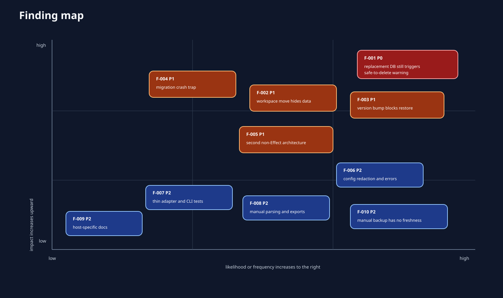
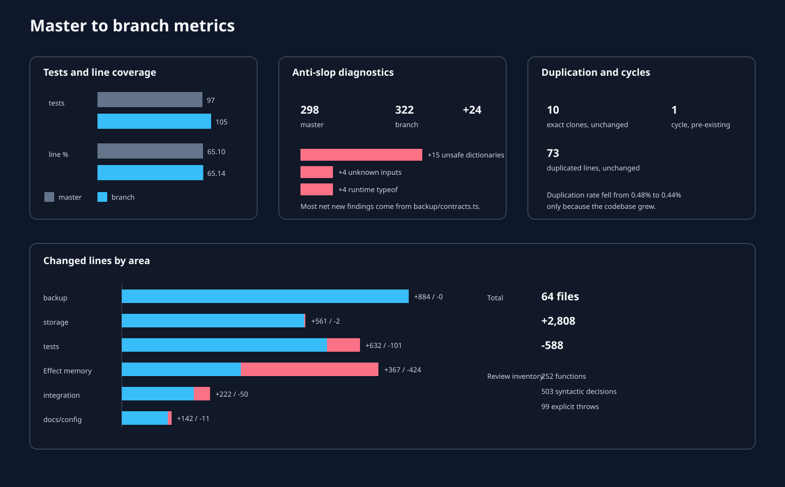

# Review of `feature/xdg-storage-migration`

## Verdict

Do not merge this branch as-is.

The branch has good safety instincts. It never deletes the legacy database, takes WAL-aware SQLite snapshots, refuses divergent restore targets, pins the requested Effect beta, and adds useful end-to-end tests. The independent validation run passed all 105 tests.

One defect still makes the migration unsafe. A valid but unrelated canonical database can sit beside a valid receipt, and Continuum will tell the user that the legacy source may be deleted. The replacement database does not need to contain any migrated records. The adversarial test in this report reproduced the false warning and the missing task.

Three more issues should be fixed before merge:

1. A workspace rename silently selects a new empty database.
2. A backup is rejected after any Continuum version bump.
3. A crash between destination migration and receipt publication leaves a conflict that cannot recover automatically.

The R2 code also went its own way. Memory now uses Effect v4 services, schemas, Config, and tagged errors. Storage and backup use synchronous functions, hand-written parsers, ambient process state, and generic thrown errors. That split is the largest source of avoidable code in the branch.

## Scorecard

| Area | Result | Notes |
| --- | --- | --- |
| Build and tests | Pass | 105 tests, typecheck, formatter, and GOAL checks pass |
| Legacy migration happy path | Pass | WAL-visible task and memory survive |
| Legacy removal proof | Fail | F-001, false positive after canonical replacement |
| Workspace identity | Needs work | F-002, absolute path hash breaks on move |
| Crash recovery | Needs work | F-004, migrated destination without receipt is stranded |
| R2 snapshot integrity | Pass | Checksums, lineage, and separate-file restore are solid |
| R2 longevity | Fail | F-003, exact application-version equality blocks future restore |
| Effect v4 memory migration | Mostly pass | Runtime, schemas, errors, Config, Result, and tests are current |
| Effect architecture as a whole | Needs work | Storage and R2 bypass it |
| Duplication and cycles | No regression | Ten clones and one cycle, both unchanged from master |
| Anti-slop | Regression | 322 findings versus 298 on master, mostly manual backup parsing |
| Prose | Pass | The changed docs triggered none of the poteto unslop pattern checks |

## Artifact index

1. [Architecture review](01-architecture.md)
2. [Code paths and decision map](02-code-paths.md)
3. [Effect, quality, and anti-slop review](03-effect-and-quality.md)
4. [Prioritized findings](04-findings.md)
5. [De-slop plan](05-deslop-plan.md)
6. [Method and evidence](06-method.md)

Visuals:

- [Architecture](diagrams/architecture.svg)
- [Storage migration decision tree](diagrams/storage-migration-flow.svg)
- [R2 protocol paths](diagrams/backup-protocol.svg)
- [Effect audit](diagrams/effect-audit.svg)
- [Metrics](diagrams/metrics.svg)
- [Risk map](diagrams/risk-map.svg)

Machine-readable evidence:

- [Metrics](data/metrics.json)
- [Findings](data/findings.json)
- [Function inventory](data/function-inventory.csv)
- [Decision points](data/decision-points.csv)
- [Decision points as JSON](data/decision-points.json)
- [Syntactic call edges](data/call-edges.csv)
- [Adversarial cases](data/adversarial-cases.json)
- [Anti-slop findings in changed files](data/anti-slop-changed-files.tsv)
- [Coverage summary](data/coverage-summary.txt)
- [Validation transcript](data/validation.txt)

## Branch delta

The branch contains six commits and changes 64 files. It adds 2,808 lines and removes 588. The main additions are 884 lines of backup production code, 561 lines of storage code, and 632 lines of tests. The Effect refactor is the only area with a net deletion.

The complete changed-source inventory contains 252 functions, 101 exported functions, 503 coarse syntactic decisions, 99 explicit throws, 19 catches, and 23 loops. The more detailed decision inventory records 565 individual conditions, cases, loops, catches, and short-circuit branches.

## Recommended merge gate

Fix F-001 through F-004 and add their adversarial tests to the repository. Then converge the backup boundary on typed Effect errors and Effect Schema before expanding cloud behavior. F-006 through F-010 can follow in focused cleanup commits, but the first four should not ship.
